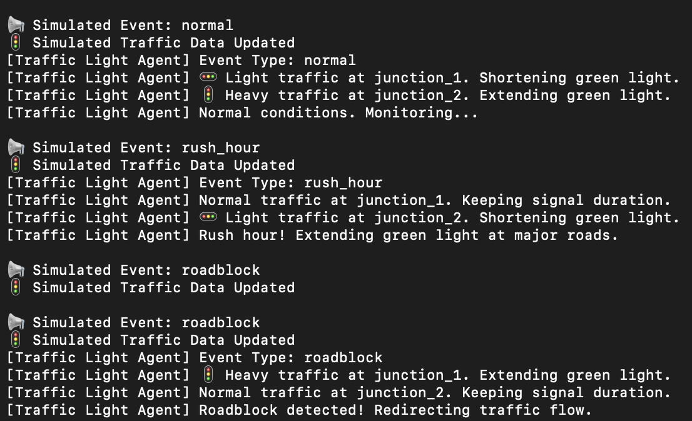

# 🛣️ Smart-Traffic-Multi-Agent-System

This project simulates an intelligent traffic management system using autonomous agents. Each agent responds to real-time traffic events and data to dynamically adjust signals, reroute vehicles, and prioritize emergencies.

## 📌 Problem Statement

Traditional traffic systems lack real-time adaptability, especially during emergencies, rush hours, or unexpected events like roadblocks. This leads to congestion, delays, and safety risks.

## 💡 Solution Overview

We built a simulation using multiple AI agents that work collaboratively to manage traffic in real time:

- Adjust signal durations based on vehicle count and events
- Detect and prioritize emergency situations
- Simulate and respond to real-time events (rush hour, roadblocks, etc.)
- Re-route or slow down vehicles as needed

## ⚙️ Project Structure

. ├── emergency_agent.py # Handles emergencies
├── vehicle_agent.py # Simulates vehicle behavior
├── traffic_light_agent.py # Controls dynamic traffic signals
├── event_simulator.py # Generates random traffic events and data
├── datasets/
│ └── traffic_data.json # Simulated traffic data
├── event.json # Simulated real-time event

## 🤖 AI Agents & Functionality

- **Event Simulator**: Generates realistic traffic events and traffic data.
- **Traffic Light Agent**: Adjusts signal duration using traffic density and events.
- **Emergency Agent**: Detects and clears the path for emergencies.
- **Vehicle Agent**: Reacts to road conditions/events (e.g., slowing, rerouting).

## 🖼️ Screenshots



## 🚧 Challenges

- Coordinating agent communication via file-based simulation
- Designing flexible logic for real-time traffic adaptation
- Managing event synchronization across multiple agents

## 🚀 Future Improvements

- Integrate with real-time APIs (e.g., live traffic feeds)
- Add a GUI dashboard for visualization
- Use MQTT or WebSockets for real-time communication
- Incorporate predictive ML models for traffic forecasting

## 🛠️ Requirements

- Python 3.x
- Run all scripts simultaneously for full simulation

## ▶️ Running the Project

Open multiple terminals and run:

```bash
python event_simulator.py
python traffic_light_agent.py
python emergency_agent.py
python vehicle_agent.py
```
